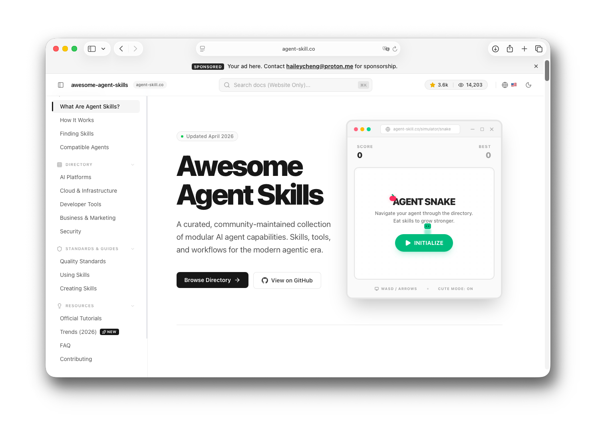
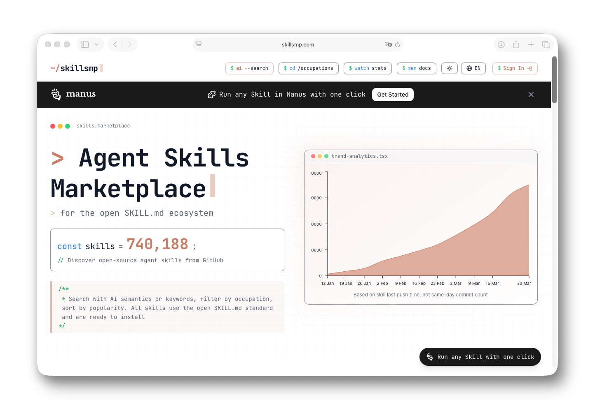
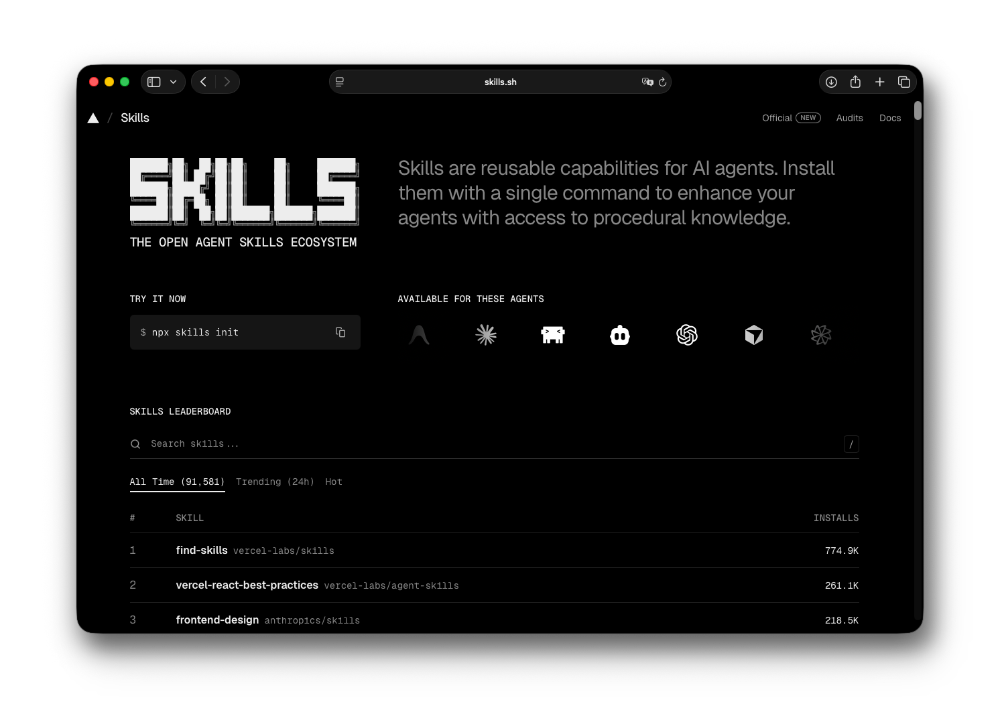

# Agent Skill Index

[English](README.md) | [繁體中文](README.zh-TW.md) | [简体中文](README.zh-CN.md) | [日本語](README.ja.md) | [한국어](README.ko.md) | [Español](README.es.md)

[](https://agent-skill.co)

> 🌐 **[agent-skill.co](https://agent-skill.co)** でライブディレクトリを閲覧する

メンテナー：[Hailey Cheng (Cheng Hei Lam)](https://www.linkedin.com/in/heilcheng/) · X [@haileyhmt](https://x.com/haileyhmt) · [haileycheng@proton.me](mailto:haileycheng@proton.me)

「agent skills」を聞いたことがありませんか？ここは、Claude、Copilot、Codex などの AI アシスタントに、再トレーニングなしで必要に応じて新しいことを教えるためのシンプルなテキストファイルのコミュニティキュレーションリストです。大量生成されたスキルリポジトリとは異なり、このコレクションは実際のエンジニアリングチームによって作成され、使用されている現実世界の Agent スキルに焦点を当てています。Claude Code、Codex、Antigravity、Gemini CLI、Cursor、GitHub Copilot、Windsurf などに対応しています。

---

## クイックスタート（30 秒）

**ステップ 1：下のディレクトリからスキルを選択する**（または [agent-skill.co](https://agent-skill.co) で閲覧）

**ステップ 2：AI エージェントに読み込む：**
- Claude Code：`/skills add <github-url>`
- Claude.ai：新しい会話に SKILL.md の raw URL を貼り付ける
- Codex / Copilot：[スキルの使用](#スキルの使用) にリンクされているプラットフォームドキュメントに従う

**ステップ 3：AI に使用を依頼する。** やりたいことを普通の日本語または英語で説明するだけです。

これだけです。インストール不要。設定不要。コーディング不要。

---

## 目次

- [Agent Skills とは？](#agent-skills-とは)
- [スキルの見つけ方（推奨）](#スキルの見つけ方推奨)
- [対応エージェント](#対応エージェント)
- [公式スキルディレクトリ](#公式スキルディレクトリ)
  - [AI プラットフォームとモデル](#ai-プラットフォームとモデル)
  - [クラウドとインフラ](#クラウドとインフラ)
  - [開発者ツールとフレームワーク](#開発者ツールとフレームワーク)
  - [Google エコシステム](#google-エコシステム)
  - [ビジネス、生産性、マーケティング](#ビジネス生産性マーケティング)
  - [セキュリティとウェブインテリジェンス](#セキュリティとウェブインテリジェンス)
- [コミュニティスキル](#コミュニティスキル)
- [スキル品質基準](#スキル品質基準)
- [スキルの使用](#スキルの使用)
- [スキルの作成](#スキルの作成)
- [公式チュートリアルとガイド](#公式チュートリアルとガイド)
- [トレンドと能力 (2026)](#トレンドと能力-2026)
- [よくある質問](#よくある質問)
- [コントリビュート](#コントリビュート)
- [連絡先](#連絡先)
- [ライセンス](#ライセンス)

---

## Agent Skills とは？

**Agent Skills** を AI アシスタントのための「使い方ガイド」と考えてください。AI があらかじめすべてを知っている必要はなく、スキルによって必要に応じて新しい能力を習得できます。料理本を丸暗記させるのではなく、レシピカードを渡すようなイメージです。

スキルは、AI に特定のタスクを実行する方法を教えるシンプルなテキストファイル（`SKILL.md` と呼ばれる）です。AI に何かを依頼すると、AI は適切なスキルを見つけ、指示を読み、作業を開始します。

### 仕組み

スキルは 3 段階で読み込まれます：

1. **ブラウズ**：AI は利用可能なスキルのリストを確認します（名前と短い説明のみ）
2. **ロード**：スキルが必要になると、AI は完全な指示を読み取ります
3. **使用**：AI は指示に従い、補助ファイルにアクセスします

### なぜこれが重要なのか

- **高速かつ軽量**：AI は必要なときに必要なものだけを読み込みます
- **どこでも動作**：スキルを一度作成すれば、対応する AI ツールでどこでも使用できます
- **共有が簡単**：スキルは単なるファイルです。コピーしたり、ダウンロードしたり、GitHub で共有したりできます

スキルは**指示**であり、コードではありません。AI は人間がガイドを読むように指示を読み、手順に従います。

---

## スキルの見つけ方（推奨）

### SkillsMP マーケットプレイス

[](https://skillsmp.com)

GitHub 上のすべての Skill プロジェクトを自動的にインデックス化し、カテゴリ、更新時間、スター数などで整理している **[SkillsMP Marketplace](https://skillsmp.com)** の使用をお勧めします。これがスキルを発見し評価する最も簡単な方法です。

### skills.sh リーダーボード (Vercel 提供)

[](https://skills.sh)

Vercel のリーダーボードである **[skills.sh](https://skills.sh)** を使用して、最も人気のある Skills リポジトリや個々のスキルの使用統計を直感的に確認することもできます。

### npx skills CLI ツール

特定のスキルについては、`npx skills` コマンドラインツールを使用して、スキルの発見、追加、管理を迅速に行うことができます。詳細は [vercel-labs/skills](https://github.com/vercel-labs/skills) を参照してください。

```bash
npx skills find [query]            # 関連スキルの検索
npx skills add <owner/repo>        # スキルの追加（GitHub 短縮形、フルURL、ローカルパス対応）
npx skills list                    # インストール済みスキルの表示
npx skills check                   # アップデートの確認
npx skills update                  # 全スキルのアップグレード
npx skills remove [skill-name]     # スキルの削除
```

---

## 対応エージェント

| エージェント | ドキュメント |
|-------|---------------|
| Claude Code | [code.claude.com/docs/en/skills](https://code.claude.com/docs/en/skills) |
| Claude.ai | [support.claude.com](https://support.claude.com/en/articles/12512180-using-skills-in-claude) |
| Codex (OpenAI) | [developers.openai.com](https://developers.openai.com/codex/skills) |
| GitHub Copilot | [docs.github.com](https://docs.github.com/copilot/concepts/agents/about-agent-skills) |
| VS Code | [code.visualstudio.com](https://code.visualstudio.com/docs/copilot/customization/agent-skills) |
| Antigravity | [antigravity.google](https://antigravity.google/docs/skills) |
| Kiro | [kiro.dev](https://kiro.dev/docs/skills/) |
| Gemini CLI | [geminicli.com](https://geminicli.com/docs/cli/skills/) |
| Junie | [junie.jetbrains.com](https://junie.jetbrains.com/docs/agent-skills.html) |

---

## 公式スキルディレクトリ

### AI プラットフォームとモデル

#### Anthropic スギル
一般的なドキュメント形式やクリエイティブなワークフローのための公式内蔵スキル。
- [anthropics/docx](https://agent-skill.co/anthropics/skills/docx) - Word ドキュメントの作成、編集、分析
- [anthropics/doc-coauthoring](https://agent-skill.co/anthropics/skills/doc-coauthoring) - 共同編集と共著
- [anthropics/pptx](https://agent-skill.co/anthropics/skills/pptx) - PowerPoint プレゼンの作成、編集、分析
- [anthropics/xlsx](https://agent-skill.co/anthropics/skills/xlsx) - Excel スプレッドシートの作成、編集、分析
- [anthropics/pdf](https://agent-skill.co/anthropics/skills/pdf) - テキスト抽出、PDF作成、フォーム処理
- [anthropics/webapp-testing](https://agent-skill.co/anthropics/skills/webapp-testing) - Playwright を使用したローカルウェブアプリのテスト

#### OpenAI スギル (Codex)
OpenAI カタログからの公式厳選スキル。
- [openai/cloudflare-deploy](https://agent-skill.co/openai/skills/cloudflare-deploy) - Cloudflare へのデプロイ
- [openai/imagegen](https://agent-skill.co/openai/skills/imagegen) - OpenAI Image API を使用した画像生成
- [openai/figma-implement-design](https://agent-skill.co/openai/skills/figma-implement-design) - Figma デザインを本番用コードに変換

#### Google Gemini スギル
[google-gemini/gemini-api-dev](https://agent-skill.co/google-gemini/skills/gemini-api-dev) 経由でインストール。
- [google-gemini/gemini-api-dev](https://agent-skill.co/google-gemini/skills/gemini-api-dev) - Gemini 駆動アプリ開発のベストプラクティス

---

## コミュニティスキル

<details>
<summary><strong>ベクトルデータベース</strong></summary>

- [qdrant/skills](https://github.com/qdrant/skills) - Qdrant のベクトル検索、スケール、性能向けスキル
</details>

<details>
<summary><strong>マーケティング</strong></summary>

- [BrianRWagner/ai-marketing-skills](https://github.com/BrianRWagner/ai-marketing-skills) - アウトリーチと監査向けのマーケティング枠組み 17 種
- [AgriciDaniel/claude-seo](https://github.com/AgriciDaniel/claude-seo) - サイト分析向けの汎用 SEO スキル
- [smixs/creative-director-skill](https://github.com/smixs/creative-director-skill) - SIT / TRIZ / SCAMPER など 20 以上の発想手法
- [SHADOWPR0/beautiful_prose](https://github.com/SHADOWPR0/beautiful_prose) - 鋭く力強い英語散文のための文体契約
</details>

<details>
<summary><strong>生産性とコラボレーション</strong></summary>

- [PSPDFKit-labs/nutrient-agent-skill](https://github.com/PSPDFKit-labs/nutrient-agent-skill) - 文書変換、OCR、個人情報の墨消し
- [RoundTable02/tutor-skills](https://github.com/RoundTable02/tutor-skills) - ドキュメントやコードベースを学習用 StudyVault にする
- [hanfang/claude-memory-skill](https://github.com/hanfang/claude-memory-skill) - ファイルに残る階層メモリ
- [wrsmith108/linear-claude-skill](https://github.com/wrsmith108/linear-claude-skill) - Linear の issue、プロジェクト、チームを管理
- [weike-zhang/grounded-ai-tutor](https://github.com/weike-zhang/grounded-ai-tutor) - 足りない一歩を平易な言葉で説明する
</details>

<details>
<summary><strong>開発とテスト</strong></summary>

- [muthuishere/hand-drawn-diagrams](https://github.com/muthuishere/hand-drawn-diagrams) - プロンプトから手描き風の Excalidraw 図を生成
- [coderabbitai/skills](https://github.com/coderabbitai/skills) - コードレビューと PR 自動修正
- [massimodeluisa/recursive-decomposition-skill](https://github.com/massimodeluisa/recursive-decomposition-skill) - 100 ファイル超の長文脈タスクを分解して進める
- [mcollina/skills](https://github.com/mcollina/skills/tree/main/skills) - Matteo Collina による Node.js / Fastify / TypeScript スキル
- [Leonxlnx/taste-skill](https://github.com/Leonxlnx/taste-skill) - 量産 UI を避けるフロントエンド技能
- [weike-zhang/project-publisher](https://github.com/weike-zhang/project-publisher) - 公開前に対外ファイルを点検して更新する
</details>

<details>
<summary><strong>コンテキストエンジニアリング</strong></summary>

- [muratcankoylan/context-compression](https://github.com/muratcankoylan/Agent-Skills-for-Context-Engineering/tree/main/skills/context-compression) - 長時間セッション向けのコンテキスト圧縮
- [muratcankoylan/memory-systems](https://github.com/muratcankoylan/Agent-Skills-for-Context-Engineering/tree/main/skills/memory-systems) - 短期記憶とグラフ記憶の設計
- [k-kolomeitsev/data-structure-protocol](https://github.com/k-kolomeitsev/data-structure-protocol) - グラフ記憶でコンテキストを速くし、リファクタを安全にする
</details>

---

## トレンドと能力 (2026)

AI エージェントのエコシステムは、反応的なチャットインターフェースから、エンドツーエンドの多段階ワークフローを実行する **自律的で目標駆動型のシステム** へと劇的に変化しました。この時期はしばしば「エージェント・リープ（エージェントの跳躍）」と呼ばれます。

### 1. 自律実行
現代のエージェントは単純な「プロンプト応答」モデルを超えています。彼らは広範な目標を多段階の戦略計画に分解し、トレードオフを検討し、独自にシーケンスを実行します。

### 2. マルチエージェントオーケストレーション
複雑なタスクは、専門のエージェントチーム（ドキュメント、テスト、コーディング）によって管理され、成果物を統合し対立を解決する「マネージャー」エージェントによって調整されます。

---

## よくある質問

### Agent Skills とは何ですか？
Agent Skills は、AI アシスタントに特定のタスクを実行する方法を教える指示ファイルです。必要なときにだけ読み込まれるため、AI は高速で集中した状態を維持できます。

### Agent Skills とファインチューニングの違いは何ですか？
ファインチューニングは AI の考え方を恒久的に変えます（コストが高く、更新が困難です）。Agent Skills は単なる指示ファイルです。AI 自体を触ることなく、いつでも更新、交換、共有が可能です。

---

## 関連する Awesome リスト

- [awesome-claude-code](https://github.com/hesreallyhim/awesome-claude-code) - Claude Code 用の厳選されたスキルとツールのリスト。
- [awesome-design-md](https://github.com/VoltAgent/awesome-design-md) - DESIGN.md プロトコルの標準とツール。
- [awesome-openclaw-skills](https://github.com/VoltAgent/awesome-openclaw-skills) - OpenClaw 用のオープンソース エージェント スキル。
- [awesome-mcp-servers](https://github.com/punkpeye/awesome-mcp-servers) - Model Context Protocol (MCP) サーバーのコレクション。

---

## 連絡先

このプロジェクトに関する質問、提携の問い合わせ、フィードバックについては：

- LinkedIn: [Hailey Cheng (Cheng Hei Lam)](https://www.linkedin.com/in/heilcheng/)
- X / Twitter: [@haileyhmt](https://x.com/haileyhmt)
- Email: [haileycheng@proton.me](mailto:haileycheng@proton.me)

---

## ライセンス
MIT ライセンス - 詳細は [LICENSE](LICENSE) ファイルを参照してください。
